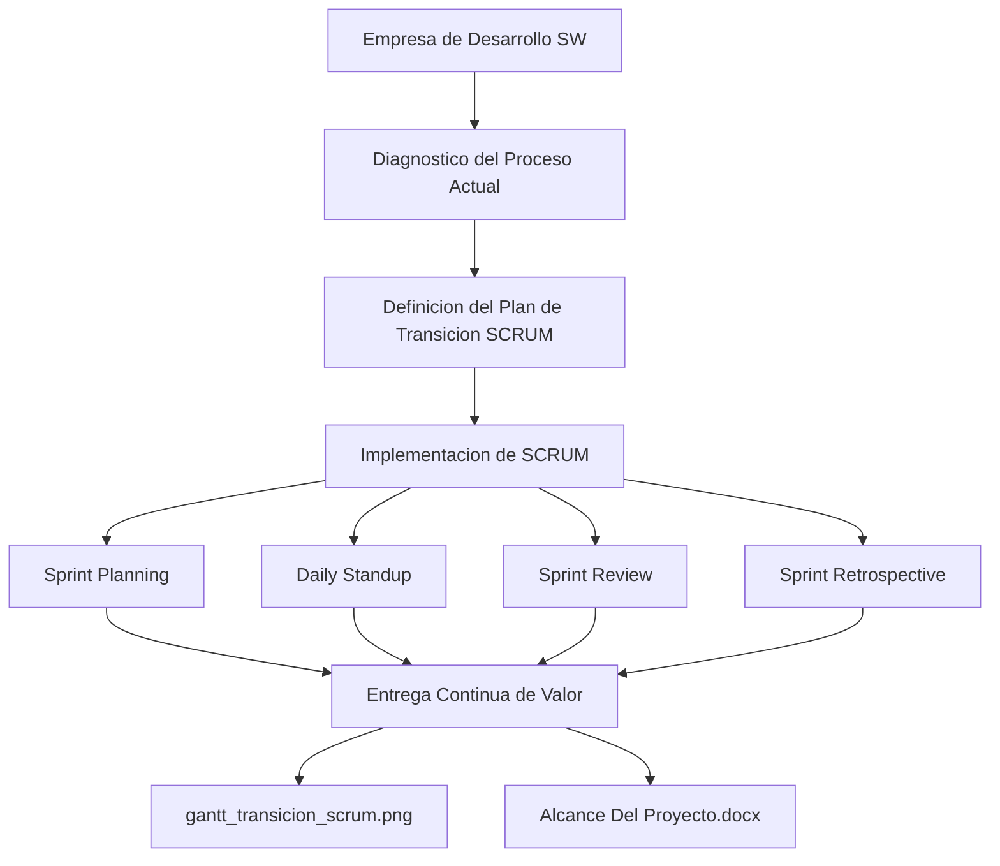

# Ingeniería de Software — Transición al Modelo de Proceso SCRUM

> Propuesta propia de transición del modelo de proceso de una empresa de desarrollo de software al marco ágil SCRUM.

## Descripción

---

Proyecto desarrollado por **Alejandro De Mendoza** que propone la migración del modelo de proceso de una empresa de desarrollo de software hacia **SCRUM**: diagnóstico del proceso actual (modelo en cascada o iterativo clásico), identificación de fricciones, definición del modelo SCRUM adaptado al contexto de la organización (roles, ceremonias, artefactos) y estrategia de gestión del cambio para la adopción ágil.

## Contenido del proyecto

### Diagnóstico del estado actual
- Mapeo del proceso existente y sus cuellos de botella
- Identificación de anti-patrones: silos, entregas tardías, falta de feedback loops

### Modelo SCRUM propuesto

| Elemento | Definición en el proyecto |
|---|---|
| **Roles** | Product Owner, Scrum Master, Development Team |
| **Sprints** | Duración de 2 semanas con Definition of Done |
| **Ceremonias** | Sprint Planning, Daily, Review, Retrospective |
| **Artefactos** | Product Backlog, Sprint Backlog, Increment |

### Plan de adopción
- Fases de transición con hitos medibles
- Formación del equipo en cultura ágil
- KPIs de seguimiento (velocity, lead time, NPS del equipo)

## Arquitectura

## Contenido del repositorio

| Archivo | Descripción |
|---|---|
| `Alcance Del Proyecto.docx` | Definición de alcance y objetivos del proyecto |
| `Desarrollo De Proyecto*.pdf` | Propuesta completa con diagnóstico y plan de adopción |
| `*.webp` | Capturas de diagramas del modelo SCRUM propuesto |

## Contexto académico

**Asignatura:** Ingeniería de Software · **Institución:** Ingeniería Informática
**Autor:** Alejandro De Mendoza — Ingeniero Informático · Especialista en Ingeniería de Software · Máster en Arquitectura de Software

---

## Autor

**Alejandro De Mendoza**  
Ingeniero Informático · Especialista en IA · Especialista en Ingeniería de Software · Máster en Arquitectura de Software

